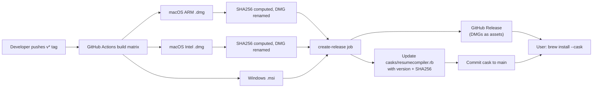

# Homebrew Cask Distribution

Distribute ResumeCompiler for macOS through Homebrew Cask, bypassing Apple's
notarization requirements. The app is unsigned (no Apple Developer account
needed), and the only cost to the user is passing `--no-quarantine` at install.


## How It Works



Every `v*` tag push triggers CI to build all platforms, compute SHA256 checksums
for both macOS DMGs, publish them as release assets, then auto-update the cask
formula in `casks/resumecompiler.rb` with the correct version and checksums,
and commit it back to the `main` branch.


## Cask Formula

**File:** `casks/resumecompiler.rb`

```ruby
cask "resumecompiler" do
  version "1.0.0"
  sha256 arm:   "abc...",
         intel: "def..."

  url arm:   "https://github.com/raphaelli/ResumeCompiler/releases/download/v#{version}/resumecompiler_#{version}_aarch64.dmg",
      intel: "https://github.com/raphaelli/ResumeCompiler/releases/download/v#{version}/resumecompiler_#{version}_x64.dmg"

  name "ResumeCompiler"
  desc "Markdown to PDF resume builder"
  homepage "https://github.com/raphaelli/ResumeCompiler"

  livecheck do
    url :url
    strategy :github_latest
  end

  app "resumecompiler.app"
end
```

Key points:

- **Architecture-aware URLs / SHA256** — Homebrew automatically selects the
  correct DMG based on the user's CPU (Apple Silicon → `aarch64`, Intel → `x64`).
- **`livecheck`** — points to GitHub releases so `brew upgrade --cask` can
  detect newer versions.
- **Unsigned app** — no `signingIdentity` in `tauri.conf.json`; no Apple
  notarization involved.


## CI/CD Flow

### 1. Build job (`build` matrix)

Each macOS target in the build matrix runs an additional step after
`npm run tauri build`:

```yaml
- name: Compute SHA256 and rename DMG (macOS)
  if: runner.os == 'macOS'
  shell: bash
  run: |
    VERSION=$(grep '"version"' .../tauri.conf.json ...)
    # determine arch from matrix target
    DMG_FILE=$(ls "$DMG_DIR"/*.dmg | head -1)
    mv "$DMG_FILE" "resumecompiler_${VERSION}_${ARCH}.dmg"
    shasum -a 256 "resumecompiler_${VERSION}_${ARCH}.dmg" \
      > "resumecompiler_${VERSION}_${ARCH}.dmg.sha256"
```

The DMG is renamed to a deterministic name (`resumecompiler_{version}_{arch}.dmg`),
and the SHA256 sidecar file is uploaded alongside it.

The existing upload step now also includes `*.sha256` files:

```yaml
path: |
  frontend/resumecompiler/src-tauri/target/release/bundle/dmg/*.dmg
  frontend/resumecompiler/src-tauri/target/release/bundle/dmg/*.sha256
  ...
```


### 2. Release job (`create-release`)

This job runs only on tag pushes (`if: github.ref_type == 'tag'`). It:

1. **Checkouts the repo** with full history (`fetch-depth: 0`) and switches to `main`.
2. **Downloads all build artifacts** (DMGs, MSIs, SHA files) from the matrix jobs.
3. **Creates a GitHub Release** with only the installer files (`.dmg`, `.msi`,
   `.exe`) — SHA sidecar files are excluded from the release.
4. **Generates the cask formula** by reading the SHA256 values from the
   per-architecture artifact groups and the version from `tauri.conf.json`.
5. **Commits and pushes** the updated `casks/resumecompiler.rb` to `main`.

**Step 5 detail:**

```yaml
- name: Commit cask update
  run: |
    git config user.name "github-actions[bot]"
    git config user.email "github-actions[bot]@users.noreply.github.com"
    git add casks/resumecompiler.rb
    if git diff --cached --quiet; then
      echo "No changes to commit — cask already up to date"
    else
      git commit -m "Update Homebrew cask to ${VERSION}"
      git push
    fi
```


## User Installation

### Prerequisites

- [Homebrew](https://brew.sh/) installed
- macOS 10.15+ (Catalina or later)


### Install

```bash
brew install --cask https://raw.githubusercontent.com/raphaelli/ResumeCompiler/main/casks/resumecompiler.rb --no-quarantine
```

The `--no-quarantine` flag tells macOS not to set the quarantine attribute on
the downloaded app. Without it, Gatekeeper would refuse to launch the unsigned
binary.


### First Launch

After install, the app is in `/Applications/resumecompiler.app`. Open it
normally from Spotlight, Launchpad, or Finder. No right-click → Open dance
needed — `--no-quarantine` already handles it.


### Upgrading

```bash
# Re-run the same command — brew fetches the latest cask from main:
brew install --cask https://raw.githubusercontent.com/raphaelli/ResumeCompiler/main/casks/resumecompiler.rb --no-quarantine
```

Or if you prefer to upgrade by version:

```bash
brew upgrade --cask resumecompiler
```

(The `livecheck` stanza in the formula enables `brew upgrade` auto-detection
of newer GitHub releases.)


### Uninstall

```bash
brew uninstall --cask resumecompiler
```

---


## Gatekeeper & `--no-quarantine`

macOS applies a quarantine flag (`com.apple.quarantine`) to files downloaded
from the internet. Gatekeeper then checks quarantined applications against
Apple's notarization service. Since the DMGs are unsigned, Gatekeeper would
block launch with _"resumecompiler cannot be opened because the developer
cannot be verified"_.

`--no-quarantine` tells Homebrew to skip setting the quarantine attribute
during extraction. The app lands in `/Applications` without the flag,
so Gatekeeper never triggers. This is the standard approach for distributing
unsigned macOS software through Homebrew Cask.


### Why not sign?

- Apple Developer Program membership costs $99/year.
- Notarization requires CI to submit builds to Apple for scanning (adds delay).
- Tauri's `signingIdentity: null` in `tauri.conf.json` already produces
  unsigned DMGs suitable for Homebrew distribution.


## Versioning

The cask version is read from `frontend/resumecompiler/src-tauri/tauri.conf.json`
(the `version` field — currently `1.0.0`). The release tag must follow the `v*`
pattern (e.g., `v1.0.0`, `v1.2.3`) and should match the tauri.conf.json version.
The CI strips the leading `v` for use in the cask formula.

| Tag push | tauri.conf.json version | Cask version | DMG filename |
|---|---|---|---|
| `v1.0.0` | `1.0.0` | `1.0.0` | `resumecompiler_1.0.0_aarch64.dmg` |
| `v1.2.3` | `1.2.3` | `1.2.3` | `resumecompiler_1.2.3_x64.dmg` |

If the tag and tauri.conf.json version disagree, the tauri.conf.json version wins
(the DMG filename and cask formula both use it).


## Comparison: Signed vs Unsigned

| Aspect | Signed + Notarized | Unsigned + Homebrew |
|---|---|---|
| Apple Developer Program | Required ($99/yr) | Not needed |
| CI complexity | Keychain setup, notarization upload, stapling | None |
| Gatekeeper on first launch | Fully transparent | `--no-quarantine` at install |
| Distribution channels | Any (web, Mac App Store) | Homebrew Cask |
| User trust | Apple-verified | Relies on Homebrew's reputation |


## Adding a New Cask to Official Homebrew (future)

If the app gains popularity, it can be contributed to `homebrew/core` or
`homebrew/cask`. The formula would move to the respective tap repository and
become installable with plain:

```bash
brew install --cask resumecompiler
```

This requires:
- App to be signed and notarized (currently not the case).
- Community PR process and code review by Homebrew maintainers.
- CI build reproducibility verification.
